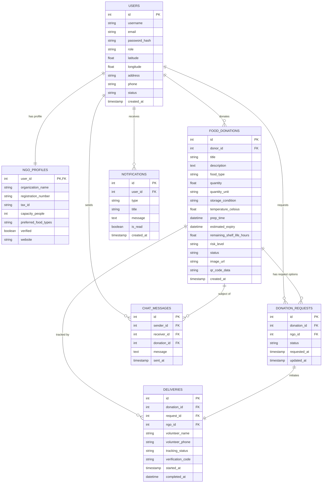
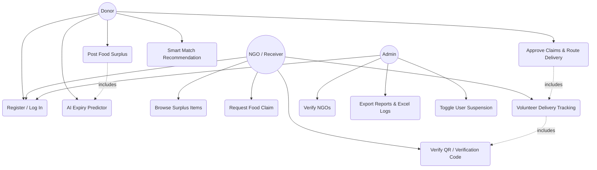
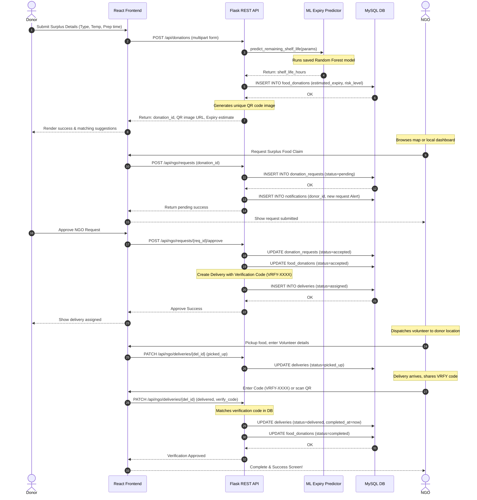

# Technical Design and UML Specifications

This document outlines the database entities, relationships, use cases, and service timelines of the AI-Driven Food Sharing Platform.

---

## 1. Entity-Relationship (ER) Diagram

---

## 2. Use Case Diagram

---

## 3. Sequence Diagram - Food Matching & Expiry Tracking

This sequence diagram depicts the transaction timeline from a donor publishing food surplus to the final NGO verification.

